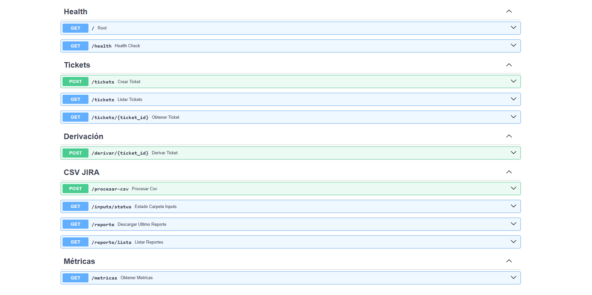
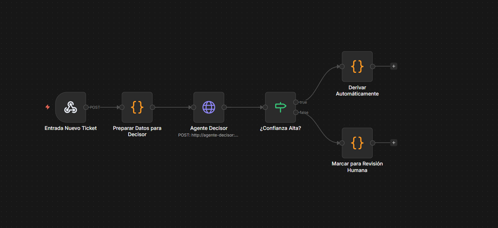
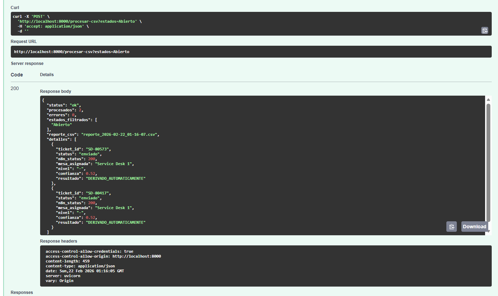
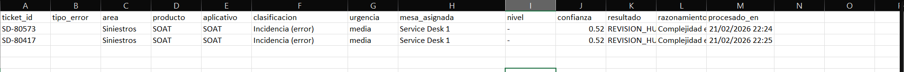
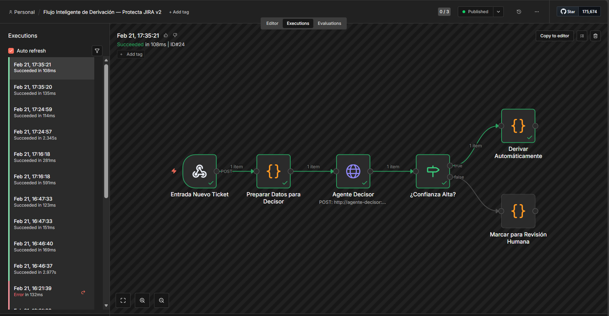

# 🎫 Sistema Inteligente de Derivación Automática de Tickets

> **Proyecto personal** desarrollado en el contexto del Curso de Sistemas Inteligentes, 2026.  
> Arquitectura multiagente para la clasificación y enrutamiento automático de tickets de soporte técnico, desarrollado sobre datos reales de una empresa de seguros peruana.

---

## 📸 Capturas del Sistema

> **📌 Instrucciones para el equipo:**  
> Coloca tus capturas de pantalla en la carpeta `IMG/` del proyecto y nómbralas `img1.png`, `img2.png`, etc.  
> A continuación se indica qué captura va en cada espacio:

| Imagen | Qué capturar |
|---|---|
| `img1.png` | Swagger UI en `http://localhost:8000/docs` mostrando todos los endpoints |
| `img2.png` | n8n con el workflow activo y sus 6 nodos visibles |
| `img3.png` | Resultado de `POST /procesar-csv` (respuesta JSON con tickets procesados) |
| `img4.png` | Archivo CSV de reporte abierto en Excel con columnas de mesa asignada |
| `img5.png` | Vista de ejecuciones en n8n (Executions tab) mostrando Succeeded |











---

## 📋 Descripción

Este sistema automatiza la derivación de tickets de soporte técnico a las mesas especializadas correspondientes, analizando cada ticket individualmente y tomando una decisión inteligente basada en:

- **Tipo y categoría de la incidencia** (campo `Tipo de atención SD`)
- **Complejidad técnica** evaluada por keywords y área organizacional
- **Capacidad disponible** de cada mesa de soporte
- **Urgencia detectada** automáticamente del texto del ticket
- **Producto afectado** (SOAT, Vida Ley, SCTR, etc.)

### 🏢 Sobre el Dataset

Los tickets utilizados para desarrollar y validar este sistema **provienen de datos reales de exportaciones JIRA** de una empresa de seguros peruana. Dichos datos fueron **modificados considerablemente** antes de su uso: se eliminaron nombres de personas, correos electrónicos, datos personales de asegurados, montos y cualquier información que pudiera identificar a clientes, trabajadores o situaciones reales de la empresa. Los datos resultantes se emplean únicamente con fines académicos para validar el comportamiento del sistema de derivación.

---

## 🏗️ Arquitectura del Sistema

```
📥 Exportación CSV de JIRA
         │
         ▼
┌─────────────────────┐
│   Agente WATCHER    │  Lee CSV más reciente de data/inputs/
│   utils/watcher.py  │  Filtra tickets con Estado = "Abierto"
└─────────────────────┘
         │
         ▼
┌─────────────────────┐
│ Agente FILTRADOR    │  Mapea columnas JIRA → campos internos
│ filtrador_features  │  Detecta urgencia en el Resumen
└─────────────────────┘
         │  payload limpio
         ▼
   ┌──────────┐
   │   n8n    │  Orquestador de flujos (puerto 5678)
   └────┬─────┘
        │
   ┌────▼─────────────┐
   │Agente COMPLEJIDAD│  Score 0-100 → BAJA / MEDIA / ALTA / MUY_ALTA
   │   puerto 8001    │  Keywords técnicas + prioridad + área
   └────┬─────────────┘
        │
   ┌────▼─────────────┐
   │ Agente CAPACIDAD │  Mesas con < 90% de carga disponibles
   │   puerto 8002    │  Selecciona la menos saturada
   └────┬─────────────┘
        │
   ┌────▼─────────────┐
   │  Agente DECISOR  │  Combina complejidad + capacidad
   │   puerto 8003    │  Calcula confianza (0.0 – 1.0)
   └────┬─────────────┘
        │
   confianza ≥ 0.4?
   ├── ✅ SÍ → DERIVADO_AUTOMATICAMENTE
   └── ⚠️  NO → REVISION_HUMANA_REQUERIDA
        │
        ▼
📊 Reporte CSV en data/outputs/reporte_FECHA.csv
```

### Mesas de Soporte (Protecta Seguros — simuladas)

| Nivel | Mesa | Especialidad |
|---|---|---|
| N1 | Service Desk 1 / 2 | Solicitudes simples, consultas |
| N2 | Squad - Mesa Ongoing | Incidentes moderados, escalamiento |
| N3 | soportedigital | Ecommerce, emisión SOAT digital |
| N3 | soporteapp | Facturación, planillas, conciliación |
| N3 | Squad - Mesa Vida Ley | Incidencias de producto Vida Ley |
| N3 | Squad - Mesa SCTR | Incidencias de producto SCTR |

---

## 📁 Estructura del Proyecto

```
proyecto/
├── IMG/                        ← 📸 Capturas de pantalla del sistema
│   ├── img1.png                   Swagger UI
│   ├── img2.png                   Workflow n8n
│   ├── img3.png                   Resultado /procesar-csv
│   ├── img4.png                   Reporte Excel
│   └── img5.png                   Ejecuciones n8n
│
├── agents/
│   ├── complejidad/main.py     ← Agente evaluador de complejidad (puerto 8001)
│   ├── capacidad/main.py       ← Agente evaluador de disponibilidad (puerto 8002)
│   └── decisor/main.py         ← Agente decisor final (puerto 8003)
│
├── api/
│   └── main.py                 ← API REST principal (puerto 8000)
│
├── data/
│   ├── inputs/                 ← 📂 Deposita aquí el CSV de JIRA para procesar
│   │   └── README.md
│   └── outputs/                ← 📊 Reportes CSV generados automáticamente
│
├── docs/
│   ├── JHAIR.md                ← Guía de tareas infraestructura
│   ├── MAURICIO.md             ← Guía de tareas ML/modelos
│   ├── MELLANY.md              ← Guía de tareas datos/reglas
│   ├── READ_GITHUB.md          ← Guía completa de setup y uso
│   └── READ_VALIDACIONES.md    ← Validación paso a paso del sistema
│
├── models/
│   └── ticket.py               ← Modelos Pydantic del sistema
│
├── utils/
│   ├── watcher.py              ← Agente Watcher (lectura de CSV)
│   ├── filtrador_features.py   ← Agente Filtrador (mapeo JIRA → interno)
│   ├── reglas_derivacion.py    ← Lógica de derivación con mesas reales
│   └── metricas.py             ← Registro de métricas del sistema
│
├── n8n_workflow_derivacion.json ← Workflow de n8n (importar en la UI)
├── docker-compose.yml          ← Orquestación de todos los servicios
├── Dockerfile                  ← Imagen de la API principal
├── Dockerfile.agent            ← Imagen compartida de los agentes
└── requirements.txt            ← Dependencias Python
```

---

## 🚀 Instalación y Puesta en Marcha

### Prerrequisitos

- **Docker Desktop** instalado y corriendo
- **Git** instalado
- **Python 3.9+** (solo para pruebas fuera de Docker)

### Paso a paso

```bash
# 1. Clonar el repositorio
git clone https://github.com/TU_USUARIO/TU_REPO.git
cd proyecto

# 2. Levantar todos los servicios
docker-compose up -d --build

# 3. Verificar que estén corriendo
docker-compose ps
```

**Resultado esperado:**
```
sistema-tickets-api     Up   0.0.0.0:8000->8000/tcp  ← API principal
agente-complejidad      Up   0.0.0.0:8001->8001/tcp
agente-capacidad        Up   0.0.0.0:8002->8002/tcp
agente-decisor          Up   0.0.0.0:8003->8003/tcp
sistema-tickets-n8n     Up   0.0.0.0:5678->5678/tcp  ← Orquestador
```

### Configurar n8n

1. Abre **http://localhost:5678** e inicia sesión
2. Ve a Workflows → Add workflow → Import from file
3. Selecciona `n8n_workflow_derivacion.json`
4. Activa el workflow (toggle → Active)

---

## 📂 Uso del Sistema

### Procesar un CSV de JIRA

1. **Exporta** tus tickets de JIRA en formato CSV (separador `;`)
2. **Copia** el archivo a la carpeta `data/inputs/`
3. **Ejecuta** el procesamiento:

```powershell
# PowerShell
Invoke-RestMethod -Uri "http://localhost:8000/procesar-csv?estados=Abierto" -Method POST | ConvertTo-Json -Depth 5
```

```bash
# Linux/Mac
curl -X POST "http://localhost:8000/procesar-csv?estados=Abierto"
```

4. El sistema genera automáticamente un reporte en `data/outputs/reporte_FECHA.csv`

### Descargar el reporte en Excel

- Abre en el navegador: **http://localhost:8000/reporte**  
  → Se descarga el CSV más reciente directamente

- O ve a la carpeta: `data/outputs/` → doble clic en el CSV → Excel

### Ver documentación de la API

Abre **http://localhost:8000/docs** → Swagger UI interactivo con todos los endpoints.

---

## 🌐 Endpoints Disponibles

| Método | Endpoint | Descripción |
|---|---|---|
| `GET` | `/health` | Estado del sistema |
| `POST` | `/tickets` | Crear ticket manual |
| `POST` | `/procesar-csv` | Procesar CSV de JIRA |
| `GET` | `/inputs/status` | CSVs disponibles en inputs/ |
| `GET` | `/reporte` | Descargar último reporte CSV |
| `GET` | `/reporte/lista` | Listar todos los reportes |
| `GET` | `/metricas` | Métricas del sistema |
| `GET` | `/equipos/estado` | Estado de todas las mesas |
| `GET` | `/docs` | Documentación Swagger |

---

## 🧪 Validación del Sistema

```powershell
# 1. Health check general
Invoke-RestMethod http://localhost:8000/health

# 2. Ver CSV disponibles
Invoke-RestMethod http://localhost:8000/inputs/status

# 3. Procesar tickets
Invoke-RestMethod -Uri "http://localhost:8000/procesar-csv?estados=Abierto" -Method POST

# 4. Ver métricas
Invoke-RestMethod http://localhost:8000/metricas
```

Ver guía completa en [`docs/READ_VALIDACIONES.md`](docs/READ_VALIDACIONES.md)

---

## 🛠️ Tecnologías Utilizadas

| Tecnología | Rol |
|---|---|
| **Python 3.12** | Backend y lógica de agentes |
| **FastAPI** | API REST de todos los servicios |
| **n8n** | Orquestador de flujos (no-code/low-code) |
| **Docker + Docker Compose** | Contenerización y orquestación |
| **pandas** | Lectura y procesamiento de CSV |
| **httpx** | Comunicación asíncrona entre agentes |
| **Pydantic** | Validación de modelos de datos |

---

## � Autor

Proyecto desarrollado de forma independiente como iniciativa personal en el contexto del Curso de **Sistemas Inteligentes**, Febrero 2026.

---

## ⚠️ Aviso sobre los Datos

> Los archivos CSV utilizados para probar este sistema fueron exportados desde el sistema JIRA de una empresa peruana de seguros. Antes de su uso, los datos fueron **anonimizados y modificados sustancialmente**: se eliminaron nombres, correos, montos, datos de pólizas y cualquier información que permita identificar personas o situaciones reales. Su uso es estrictamente personal y académico.

---

## 📝 Licencia

Proyecto personal — Curso **Sistemas Inteligentes**, Febrero 2026.  
No apto para uso en producción sin las adaptaciones correspondientes.